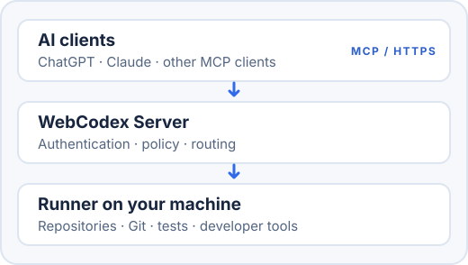

<p align="right"><a href="README.md">English</a> · <a href="README.zh-CN.md">简体中文</a></p>

<p align="center">
  <picture>
    <source media="(prefers-color-scheme: dark)" srcset="docs/assets/brand/webcodex-mark-dark.svg">
    
  </picture>
</p>

<h1 align="center">WebCodex</h1>

<p align="center"><strong>让云端 AI Agent 使用你自己机器上的真实开发环境。</strong></p>
<p align="center">把 ChatGPT、Claude 等 MCP 客户端连接到你已有的代码仓库、Git 工作区、编译器、测试和开发工具。</p>
<p align="center"><a href="#先试一个仓库">快速试用</a> · <a href="#完整配置">完整配置</a> · <a href="docs/INDEX.zh-CN.md">文档</a> · <a href="SECURITY.md">安全说明</a></p>

<p align="center">
  <a href="docs/MCP.zh-CN.md"></a>
  <a href="docs/QUICK_START.zh-CN.md#前置条件"></a>
  <a href="LICENSE"></a>
</p>

<p align="center">
  <picture>
    <source media="(prefers-color-scheme: dark)" srcset="docs/assets/readme/webcodex-overview-dark.svg">
    
  </picture>
</p>

## 先试一个仓库

进入愿意让 AI 查看和操作的仓库，运行：

```bash
cd /path/to/your/repository
npx --yes @yyjeqhc/webcodex share
```

这会启动一个**临时、单项目、能力受限的试用环境**。保持命令运行，按输出的 MCP 连接信息接入；退出命令后，连接地址和临时凭据便会失效。准备条件与 ChatGPT 接入步骤见[快速试用指南](docs/QUICK_START.zh-CN.md)。

## 完整配置

日常开发建议运行普通 **Server + Runner**。Runner 在代码和工具链所在的机器上工作，Server 为 AI 客户端提供通往已注册项目的认证入口。完整配置支持多个项目和完整开发流程。

先运行 `npm install -g @yyjeqhc/webcodex`，再按[完整使用指南](docs/PERSONAL_SETUP.zh-CN.md)配置。公网 HTTPS 或 Tunnel 只是连接 Server 的方式，不会替代普通完整配置。

## 为什么用 WebCodex

- **使用真实仓库。** Runner 在你机器上已注册的项目目录中工作，直接使用现有 Git 工作区。
- **使用真实工具链。** 在配置的边界内读取、修改代码，检查 Git，并运行编译器、测试、格式化工具和项目命令。
- **看得见长时间任务。** 超过快速响应时间的命令和检查会作为 Job 继续运行，可以查看有界的状态与输出，也可以停止。
- **方便审查工作。** 项目策略、受保护的编辑、Git 差异、验证结果和运行记录帮助你核对实际变化。

## 工作方式

WebCodex 是自行托管的开发执行桥梁。AI 客户端通过 MCP 调用 Server；Server 负责认证和路由请求，仓库所在机器上的 Runner 执行具体操作。Server 不会扫描你的文件系统来寻找项目。详细说明见[架构文档](docs/ARCHITECTURE.md)。

## 安全与控制

仓库留在拥有它的机器上；工具返回的结果（包括按请求读取的文件片段）可能传给 AI 客户端。只注册打算开放的项目，妥善保管凭据，并在接受结果前审查改动。WebCodex 能读取和修改已注册项目中的文件，也能运行有较大权限的项目命令；连接敏感项目之前请阅读[安全说明](SECURITY.md)。

## 平台支持

| 平台 | 快速试用 | 日常配置 |
| --- | --- | --- |
| Linux x64 / arm64 | `share` | Server + Runner |
| macOS x64 / arm64 | `share` | Runner 连接 Server |
| Windows x64 | `share` | 前台 Server + Runner |
| Windows arm64 | 显式选择受支持的 Tunnel 选项使用 `share` | 前台 Server + Runner |

默认自动管理的 Cloudflare 试用流程适用于 Linux、macOS 和 Windows x64。Windows arm64 的 Tunnel 细节及服务限制见[部署指南](docs/DEPLOYMENT.zh-CN.md)和 [MCP](docs/MCP.zh-CN.md)。

## 文档

**开始使用：**[快速试用](docs/QUICK_START.zh-CN.md) · [完整配置](docs/PERSONAL_SETUP.zh-CN.md) · [AI 辅助接入](docs/AI_ONBOARDING.zh-CN.md)

**连接客户端：**[MCP](docs/MCP.zh-CN.md) · [CLI](docs/CLI.zh-CN.md)

**安全运维：**[安全说明](SECURITY.md) · [部署指南](docs/DEPLOYMENT.zh-CN.md) · [故障排查](docs/TROUBLESHOOTING.zh-CN.md)

**了解架构：**[架构说明](docs/ARCHITECTURE.md) · [认证模型](docs/AUTH_MODEL.zh-CN.md) · [全部文档](docs/INDEX.zh-CN.md)

## 构建与贡献

普通用户可直接通过 npm 安装。如果需要从源码构建二进制文件：

```bash
cargo build --release --workspace --bins
export PATH="$PWD/target/release:$PATH"
```

开发流程和 Pull Request 要求见[贡献指南](CONTRIBUTING.zh-CN.md)。

## 致谢

感谢 [LINUX DO](https://linux.do/) 社区提供技术交流与开源分享的空间。

## 许可证

采用 Apache License 2.0，见 [LICENSE](LICENSE)。
